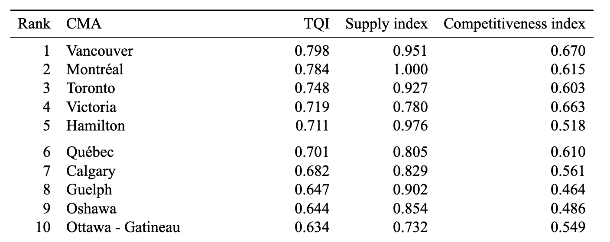
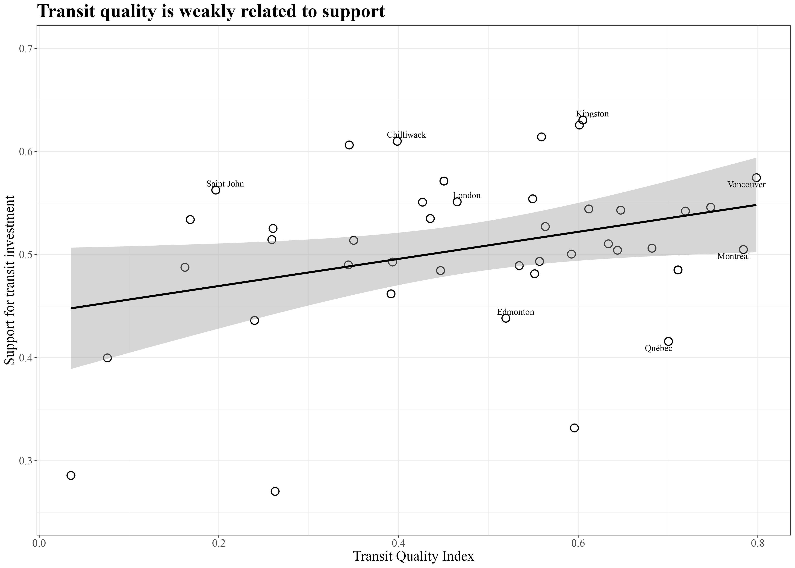
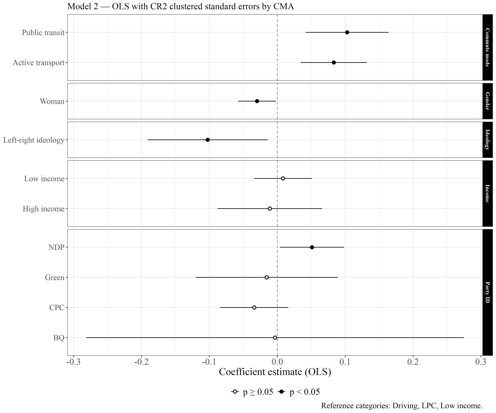
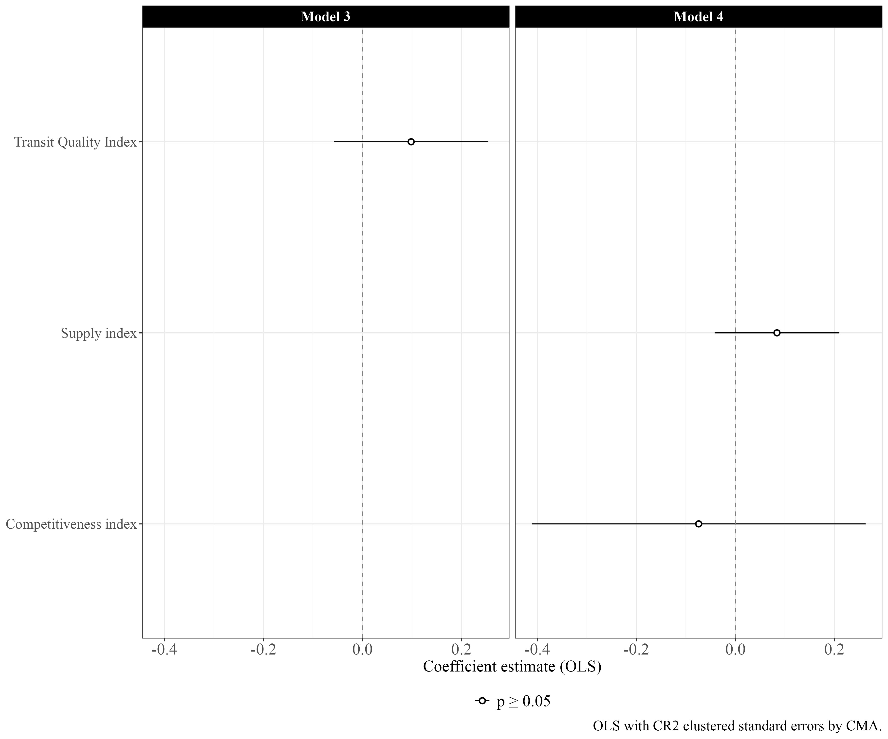
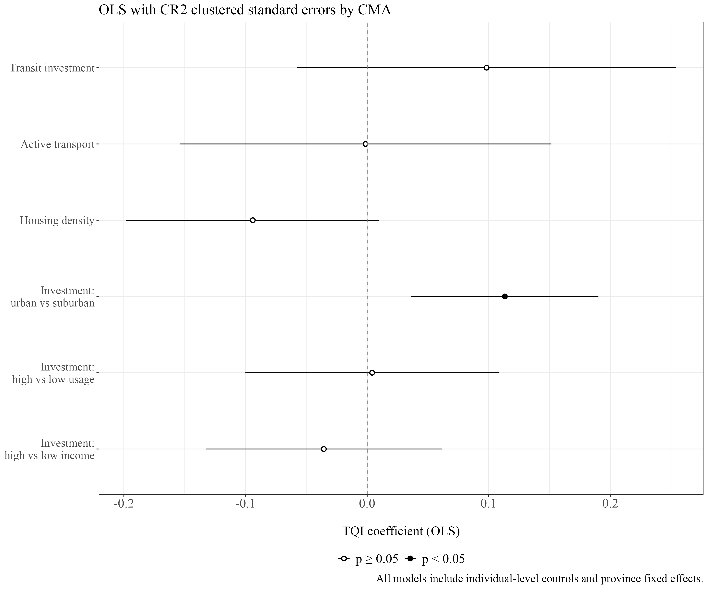
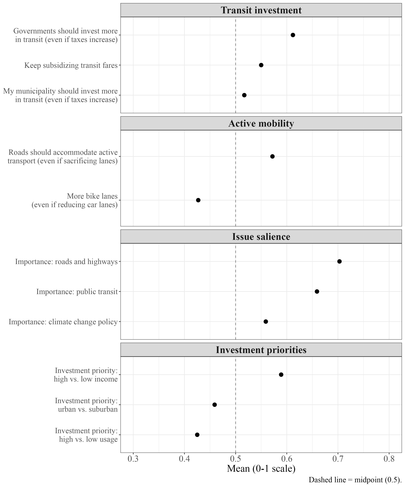

## Canadian Public Transit Investment

- Canadian municipalities invest massively in public transit projects
- The federal government funds $25 Billion over 10 years for transit projects
- Many projects are controversial

- *Do Canadians support public transit investment?*

## What We Know

- Individual predictors of [**transit policy support**]{.highlight} are:
    - Commute mode
    - Ideology and demographics
- Mode-switch indicators and ridership satisfaction
- The **Quality Paradox**: Transit quality does not translate into *satisfaction*

## What We Don't Know

- No urban comparative research on Canadian cities
- Is public transit **quality** associated with transit **attitudes**?
    - Does the quality paradox about satisfaction also apply to [**policy support**]{.highlight}?

## Research Questions

**RQ1:** How do transit and urban mobility policy attitudes vary across Canadian cities?

**RQ2:** Which *individual-level* factors are associated with urban mobility attitudes in Canadian cities?

**RQ3:** Is city-level [**transit quality**]{.highlight} associated with individual policy attitudes?

## Data

- Survey data from the Canadian Municipal Barometer in winter 2025
    - Includes Public transit support items
        - *My municipality should invest more in public transit infrastructure in my neighbourhood, even if it means a slight increase in taxes.* (n = 4,183)
    - Respondents linked to their **CMA** through postal code

:::{.notes}
I know this might not be the best item for a broader indicator of transit support. There are reasons why I rely on this item and not others or a scale that are related to the survey design, we can talk about this during the question period if you want. I did make a few tests and the findings are consistent across alternative dependent variables.
:::

## Transit Quality Index

- Data from Statistics Canada
- GTFS files and commute time
- [**42**]{.highlight} census areas with a population of 100,000 or more

## Transit Quality Index

:::: {.columns}
::: {.column width="50%"}

<strong>Supply</strong>

- Route km per [**area**]{.highlight}
- Service frequency
- Modal weights
:::
::: {.column width="50%"}

<strong>Competitiveness</strong>

- [**Transit**]{.highlight} commute time vs [**car**]{.highlight} commute time
- Across five distance bands between 1 and 15 km
:::
::::

:::{.notes}
I like doing it per area because it accounts for suburban sprawl, which is very common in Canada
:::

## TQI rankings

{fig-align="center"}

## Between-city Variance

{fig-align="center"}

:::{.notes}
- ANOVA and ICC (intraclass correlation coefficient) tests, city-membership only accounts for about 2 to 3% of the variance in attitudes. People are not much more alike within cities than they are across cities.

- No time for all results included in the paper, can show you more later
:::

## Regression Findings

{fig-align="center"}

:::{.notes}
Provincial fixed effects and other controls
:::

## Regression Findings

{fig-align="center"}

## Implications

- Geographical context more impactful at the *provincial* level?
    - Transit funding is mostly a provincial responsibility
    - Provincial and federal political cultures shape the policy environment?
- The [**Quality Paradox**]{.highlight}
    - Improving quality ≠ support for expansion?
    - Quality of the system doesn't matter?
- *Individual* factors are the best predictors

::: {.notes}
1. If city membership only explain 2-3% of variance in public transit investment support, and provincial fixed effects absorb variation, then geo context is not impactful at the city level.
2. The quality paradox is not only related to satisfaction, but to investment support. The feedback loop between service provision and political demand may not be as impactful as anticipated by many transit supporters. 
3. Commute mode - people who use transit are in favor of investment. Ideology is important too.
:::

## Conclusion

- Improving the Transit Quality Index
    - Neighbourhood-level analysis
    - Adding elements to an incomplete quality index
- Existence of a virtuous cycle of transit expansion

::: {.notes}
1. There is a lot of variation inside a city, between neighbourhoods. An analysis of transit quality and support at the neighbourhood level might reveal some very interesting findings.
2. The index leaves out many more indicators of transit quality, such as reliability and accessibility.
3. The fact that better transit doesn't correlate with transit investment support doesn't necessarily mean that there isn't a virtuous cycle of transit expansion. Because if commute mode is a predictor of transit support, expanding the transit grid should inevitably bring more people to use it, and eventually support transit investment. I might just be more indirect than assumed.
:::

## Appendix

### Alternative Dependent Variables

{fig-align="center" width="500"}

## Appendix

### Urban Mobility Attitudes

{fig-align="center" width="450"}