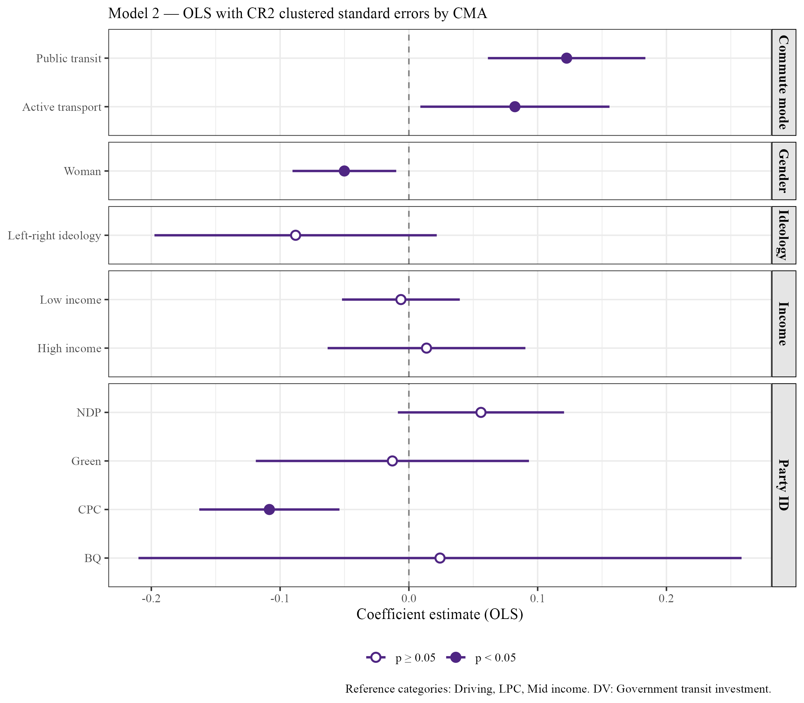
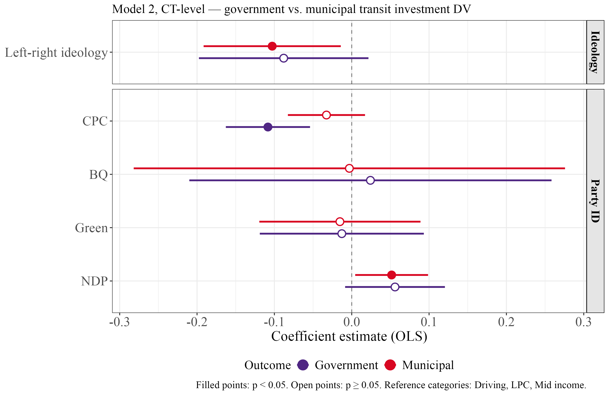
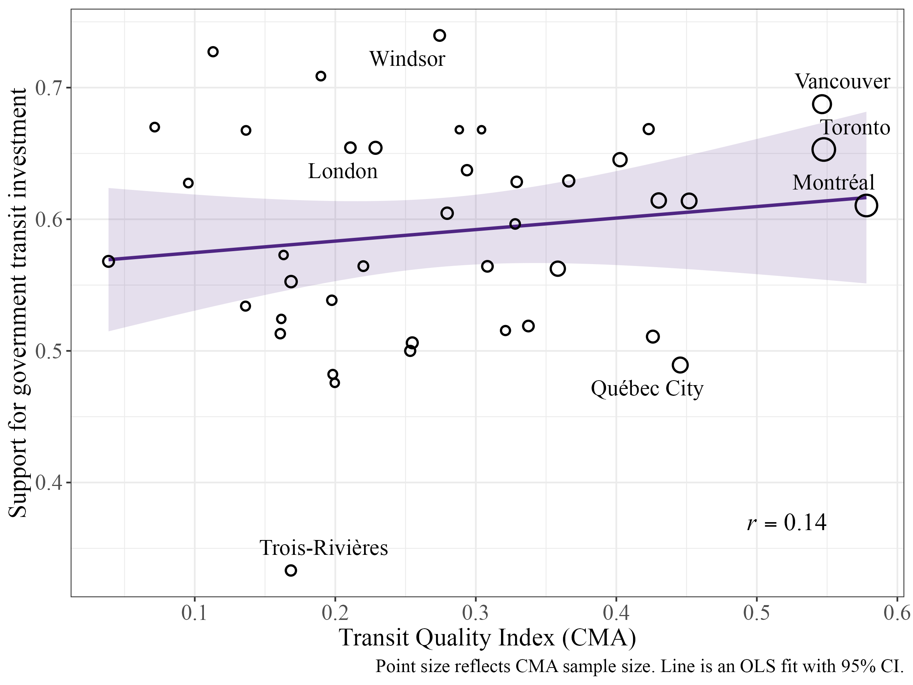
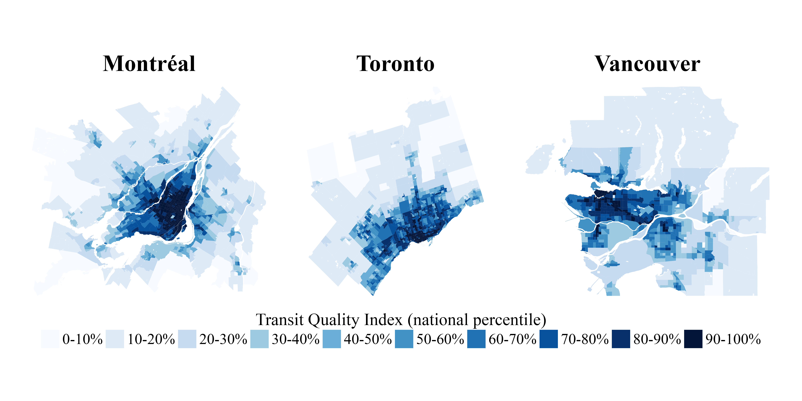
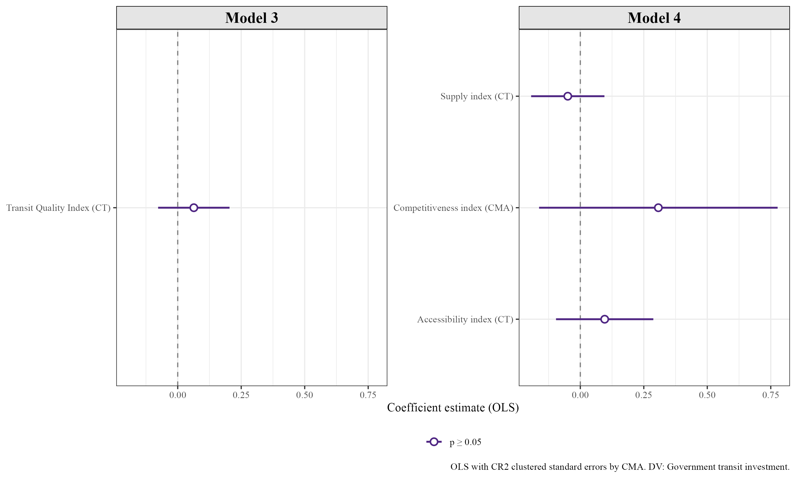
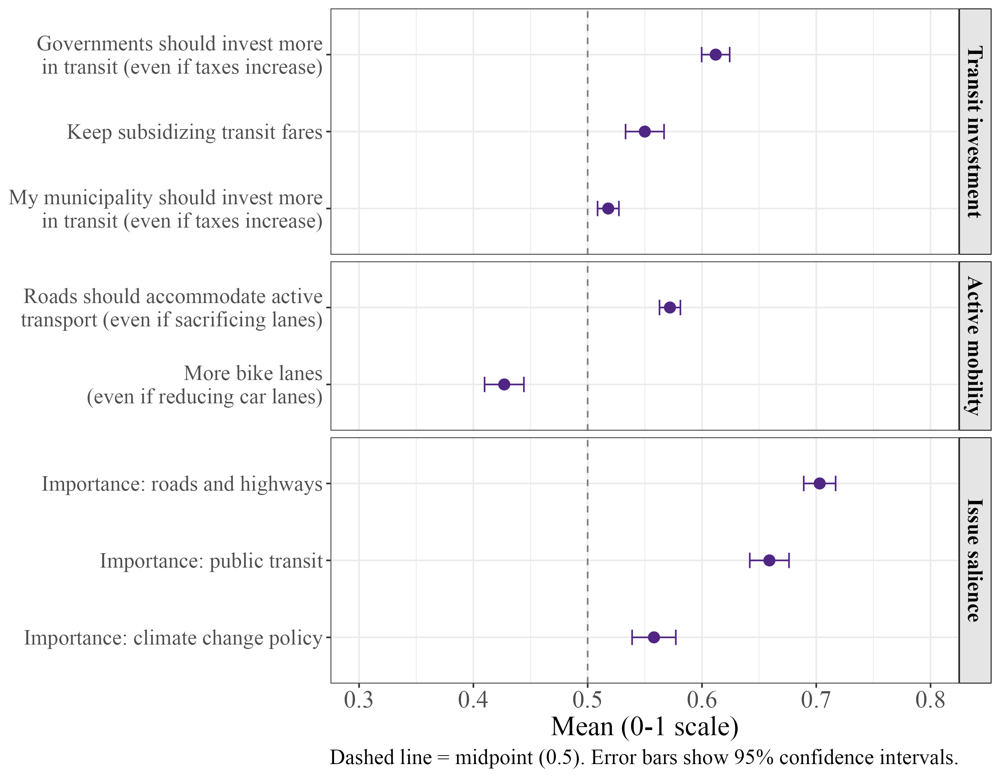

## Canadian Public Transit Investment

- Canadian municipalities invest massively in public transit projects
- $25 Billion fund over 10 years for transit projects by the federal government
- Projects are salient and controversial

*Do Canadians support public transit* **investment?**

## What We Know

- Individual predictors of [**transit policy support**]{.highlight} are:
    - Commute mode
    - Ideology and demographics
- Mode-switch indicators and ridership satisfaction

- The **Quality Paradox**: Transit quality does not translate into *satisfaction*

## What We Don't Know

- No urban comparative research on Canadian cities
- Is public transit **quality** associated with transit **attitudes**?
    - Does the **quality paradox** about satisfaction also apply to [**policy support**]{.highlight}?

## Research Questions

**RQ1:** How do transit policy attitudes vary across Canadian cities?

**RQ2:** Which *individual-level* factors are associated with transportation policy attitudes in Canadian cities?

**RQ3:** Is [**transit quality**]{.highlight} associated with individual transit policy attitudes?

## Data

- Survey data from the Canadian Municipal Barometer in winter 2025
    - Includes Public transit support items

*The government should invest more in public transit*
 
*infrastructure, even if it means a slight*
 
*increase in taxes. (n = 2,322)*

- Respondents are matched to their **CMA** and **census tract** ([**NEW!**]{.new}) through postal code

## Individual Predictors

{fig-align="center"}

:::{.notes}
Provincial fixed effects and other controls
:::

## A Coherent Direction for Ideology and PID

{fig-align="center" width="850"}

:::{.notes}
Pooling across the government and municipal DV: ideology, CPC identification, and NDP identification all point the same direction for both outcomes. What changes is only whether the estimate clears conventional significance, not its sign.
:::

## Transit Quality Index

- Data from Statistics Canada
- GTFS files, commute time and spatial access measure
- All [**41**]{.highlight} CMAs (Population 100,000+)
- [**6,052**]{.highlight} Census Tracts of the 41 CMAs

## Transit Quality Index

:::: {.columns}
::: {.column width="33%"}

<strong>Supply</strong>

- Route km per [**area**]{.highlight}
- Service frequency
- Modal weights
:::
::: {.column width="33%"}

<strong>Competitiveness</strong>

- [**Transit**]{.highlight} commute time vs [**car**]{.highlight} commute time
- Across five distance bands between 1 and 15 km
:::
::: {.column width="33%"}

<strong>Accessibility [NEW!]{.new}</strong>

- Stop [**density**]{.highlight} by CT
- Transit spacial access measure (**SAM**)
:::
::::

:::{.notes}
CT - CMA - CT

- How easy it is to get from a geographical point to a point of interest.
- In a neighborhood, hot easy it is to get to a transit stop, and then with this transit how easy it is to get to a point of interest.
:::

## TQI rankings by CMA

<table style="margin: 0 auto; border-collapse: collapse; font-size: 0.7em; width: 90%;">
<thead>
<tr>
<th style="padding: 6px 10px; text-align: right; font-weight: 600;">Rank</th>
<th style="padding: 6px 10px; text-align: left; font-weight: 600;">CMA</th>
<th style="padding: 6px 10px; text-align: right; font-weight: 600;">TQI</th>
<th style="padding: 6px 10px; text-align: right; font-weight: 600;">Supply</th>
<th style="padding: 6px 10px; text-align: right; font-weight: 600;">Accessibility</th>
<th style="padding: 6px 10px; text-align: right; font-weight: 600;">Competitiveness</th>
</tr>
</thead>
<tbody>
<tr><td style="padding: 5px 10px; text-align: right;">1</td><td style="padding: 5px 10px;">Montréal</td><td style="padding: 5px 10px; text-align: right;">0.578</td><td style="padding: 5px 10px; text-align: right;">1.000</td><td style="padding: 5px 10px; text-align: right;">0.314</td><td style="padding: 5px 10px; text-align: right;">0.615</td></tr>
<tr><td style="padding: 5px 10px; text-align: right;">2</td><td style="padding: 5px 10px;">Toronto</td><td style="padding: 5px 10px; text-align: right;">0.548</td><td style="padding: 5px 10px; text-align: right;">0.925</td><td style="padding: 5px 10px; text-align: right;">0.294</td><td style="padding: 5px 10px; text-align: right;">0.603</td></tr>
<tr><td style="padding: 5px 10px; text-align: right;">3</td><td style="padding: 5px 10px;">Vancouver</td><td style="padding: 5px 10px; text-align: right;">0.546</td><td style="padding: 5px 10px; text-align: right;">0.950</td><td style="padding: 5px 10px; text-align: right;">0.256</td><td style="padding: 5px 10px; text-align: right;">0.670</td></tr>
<tr><td style="padding: 5px 10px; text-align: right;">4</td><td style="padding: 5px 10px;">Calgary</td><td style="padding: 5px 10px; text-align: right;">0.452</td><td style="padding: 5px 10px; text-align: right;">0.825</td><td style="padding: 5px 10px; text-align: right;">0.199</td><td style="padding: 5px 10px; text-align: right;">0.561</td></tr>
<tr><td style="padding: 5px 10px; text-align: right;">5</td><td style="padding: 5px 10px;">Québec</td><td style="padding: 5px 10px; text-align: right;">0.445</td><td style="padding: 5px 10px; text-align: right;">0.800</td><td style="padding: 5px 10px; text-align: right;">0.181</td><td style="padding: 5px 10px; text-align: right;">0.610</td></tr>
<tr><td style="padding: 5px 10px; text-align: right;">6</td><td style="padding: 5px 10px;">Ottawa–Gatineau</td><td style="padding: 5px 10px; text-align: right;">0.430</td><td style="padding: 5px 10px; text-align: right;">0.725</td><td style="padding: 5px 10px; text-align: right;">0.200</td><td style="padding: 5px 10px; text-align: right;">0.549</td></tr>
<tr><td style="padding: 5px 10px; text-align: right;">7</td><td style="padding: 5px 10px;">Hamilton</td><td style="padding: 5px 10px; text-align: right;">0.426</td><td style="padding: 5px 10px; text-align: right;">0.975</td><td style="padding: 5px 10px; text-align: right;">0.153</td><td style="padding: 5px 10px; text-align: right;">0.518</td></tr>
<tr><td style="padding: 5px 10px; text-align: right;">8</td><td style="padding: 5px 10px;">Victoria</td><td style="padding: 5px 10px; text-align: right;">0.423</td><td style="padding: 5px 10px; text-align: right;">0.775</td><td style="padding: 5px 10px; text-align: right;">0.147</td><td style="padding: 5px 10px; text-align: right;">0.663</td></tr>
<tr><td style="padding: 5px 10px; text-align: right;">9</td><td style="padding: 5px 10px;">Winnipeg</td><td style="padding: 5px 10px; text-align: right;">0.403</td><td style="padding: 5px 10px; text-align: right;">0.450</td><td style="padding: 5px 10px; text-align: right;">0.223</td><td style="padding: 5px 10px; text-align: right;">0.651</td></tr>
<tr><td style="padding: 5px 10px; text-align: right;">10</td><td style="padding: 5px 10px;">Kitchener–Cambridge–Waterloo</td><td style="padding: 5px 10px; text-align: right;">0.366</td><td style="padding: 5px 10px; text-align: right;">0.875</td><td style="padding: 5px 10px; text-align: right;">0.132</td><td style="padding: 5px 10px; text-align: right;">0.426</td></tr>
</tbody>
</table>

## Across-city Variance

{fig-align="center"}

:::{.notes}
- ANOVA and ICC (intraclass correlation coefficient) tests, city-membership only accounts for about 2 to 3% of the variance in attitudes. People are not much more alike within cities than they are across cities.
:::

## Value of Census Tract Analysis

{.r-stretch fig-align="center"}

## Transit Quality Effect?

{fig-align="center"}

## Implications

- Geographical context more impactful at the *provincial* level?
    - Transit funding is mostly a provincial responsibility
    - Provincial and federal political cultures shape the policy environment?
- The [**Quality Paradox**]{.highlight}
    - Improving quality ≠ support for expansion?
    - Quality of the system doesn't matter?
- *Individual* factors are the best predictors

::: {.notes}
1. If city membership only explain 2-3% of variance in public transit investment support, and provincial fixed effects absorb variation, then geo context is not impactful at the city level.
2. The quality paradox is not only related to satisfaction, but to investment support. The feedback loop between service provision and political demand may not be as impactful as anticipated by many transit supporters. 
3. Commute mode - people who use transit are in favor of investment. Ideology is important too.
:::

## {.center}

Thank you and take care!

## Urban Mobility Attitudes

{fig-align="center" width="800"}